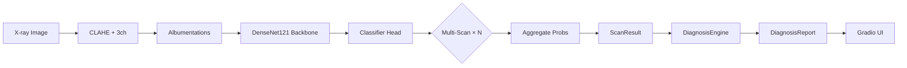

# 🫁 Vixora Radiology — Project Walkthrough

## Overview

A **production-grade chest X-ray classification system** that detects **6 thoracic conditions** (normal, pneumonia, pneumothorax, tuberculosis, cardiomegaly, effusion) using a DenseNet121 backbone with domain-specific pretraining from TorchXRayVision. The core differentiator is a **multi-scan inference engine** that performs N stochastic forward passes with MC Dropout + augmentation, then aggregates results for robust, uncertainty-aware predictions.

---

## Project Tree (relevant files only)

```
vixora-radiology/
├── config.py           # Central config: paths, hyperparams, thresholds
├── dataset.py          # CLAHE preprocessing + Albumentations pipelines + Dataset/DataLoader
├── model.py            # DenseNet121 backbone (TorchXRayVision or ImageNet fallback) + classifier head
├── train.py            # Full training loop: FocalLoss, Mixup, warm-up, early stopping, TensorBoard
├── evaluate.py         # Test-set evaluation: metrics, confusion matrix, ROC-AUC
├── inference.py        # Multi-scan inference engine (core innovation)
├── diagnosis.py        # Post-diagnosis: severity scoring, clinical interpretation, medication guidance
├── app.py              # Gradio web interface
├── requirements.txt    # Dependencies
├── README.md           # User-facing documentation
├── RoadMap.md          # Development roadmap / EDA plan
├── src/
│   ├── dataset_sources.txt   # Kaggle dataset URLs per condition
│   └── disseases.txt         # Full chest X-ray taxonomy with status tracking
├── notebooks/
│   ├── cleaning.ipynb        # Data cleaning notebook
│   └── training.ipynb        # Training notebook
├── checkpoints/              # 12 model checkpoints (best + periodic + last)
├── logs/                     # TensorBoard events + train.log (50 epochs completed)
└── results/                  # Empty (eval outputs go here)
```

---

## Module-by-Module Breakdown

### 1. [config.py](file:///wsl$/Ubuntu/home/maaroufpy/projects/vixora-radiology/config.py) — Central Configuration

All hyperparameters and paths in one place:

| Category | Key Settings |
|----------|-------------|
| **Image** | 320×320 resolution, 3-channel (grayscale replicated) |
| **Model** | DenseNet121 via TorchXRayVision (`densenet121-res224-all`), dropout=0.4 |
| **Training** | 60 epochs, LR=2e-4, AdamW, cosine annealing (η_min=1e-6), gradient clip=1.0 |
| **Loss** | Focal Loss (γ=2.0) + label smoothing (ε=0.1) + class weights `[1.0, 1.5, 2.0, 1.3, 1.0, 1.4]` |
| **Mixup** | α=0.3, disabled in last 10% of epochs |
| **Warm-up** | 5 epochs backbone frozen, then unfreeze with discriminative LR |
| **Inference** | 6 scans, mean aggregation, primary threshold=0.35, secondary=0.25 |
| **Diagnosis** | Severity thresholds: critical≥0.80, high≥0.60, moderate≥0.40, low≥0.20 |

---

### 2. [dataset.py](file:///wsl$/Ubuntu/home/maaroufpy/projects/vixora-radiology/dataset.py) — Data Pipeline

**Pipeline per sample:**
```
PIL Image → Grayscale (H×W uint8) → CLAHE → 3-channel (H×W×3) → Albumentations → Tensor
```

**Key components:**
- **`CLAHE`** class — OpenCV CLAHE for local contrast enhancement (clip=2.0, grid=8×8)
- **`get_train_transform()`** — Full medical augmentation: HFlip, ShiftScaleRotate (±10°), ElasticTransform/GridDistortion, RandomBrightnessContrast, GaussianBlur, GaussNoise → Resize(320) → Normalize(ImageNet) → ToTensor
- **`get_val_transform()`** — Deterministic: Resize(320) → Normalize → ToTensor
- **`get_stochastic_inference_transform()`** — Light augmentation for multi-scan inference
- **`get_deterministic_inference_transform()`** — Clean anchor for first scan pass
- **`ChestXrayDataset`** — Folder-based dataset, loads from `data/processed/{split}/{class}/`
- **`build_dataloaders()`** — Factory returning (train, val, test) DataLoaders

---

### 3. [model.py](file:///wsl$/Ubuntu/home/maaroufpy/projects/vixora-radiology/model.py) — Model Architecture

```
DenseNet121 Backbone (TorchXRayVision pretrained on CheXpert+NIH+MIMIC+PadChest)
    │
    ├── features(x)           → (B, 1024, h, w)
    ├── ReLU + AdaptiveAvgPool → (B, 1024)
    └── Classifier Head:
         BN(1024) → Dropout(0.4) → Linear(1024→512) → GELU
         → BN(512) → Dropout(0.2) → Linear(512→6)
```

**Key methods:**
- `enable_mc_dropout()` — Forces dropout layers into train mode for Monte-Carlo inference
- `freeze_backbone()` / `unfreeze_backbone()` — For warm-up schedule
- `build_model()` — Factory that creates + moves to device
- `load_model()` — Loads checkpoint for inference/evaluation

---

### 4. [train.py](file:///wsl$/Ubuntu/home/maaroufpy/projects/vixora-radiology/train.py) — Training Pipeline

**Training strategy (v2):**

1. **FocalLoss** — `-(1-pt)^γ · log(pt)` focuses on hard/ambiguous samples
2. **Mixup** — Beta(0.3, 0.3) interpolation of image pairs; disabled in last 10% of epochs for sharp boundaries
3. **Class weights** — Confusion-guided: pneumothorax=2.0×, pneumonia=1.5×, effusion=1.4×
4. **Warm-up** — Backbone frozen for 5 epochs (head-only training), then unfrozen with discriminative LR:
   - Backbone: `LR × 0.1`
   - Head: `LR × 0.3`
5. **Cosine annealing** — From 2e-4 → 1e-6
6. **Early stopping** — Patience=10 on validation macro F1
7. **Checkpointing** — Best model + every 5 epochs + last model
8. **TensorBoard** — Loss, macro F1, per-class F1 logged per epoch

**Training status:** 50 epochs completed with periodic checkpoints saved.

---

### 5. [evaluate.py](file:///wsl$/Ubuntu/home/maaroufpy/projects/vixora-radiology/evaluate.py) — Test Evaluation

Outputs:
- Classification report (precision/recall/F1 per class)
- Macro & weighted F1
- Per-class ROC-AUC (one-vs-rest)
- Confusion matrix PNG → `results/confusion_matrix.png`
- JSON summary → `results/test_results.json`

---

### 6. [inference.py](file:///wsl$/Ubuntu/home/maaroufpy/projects/vixora-radiology/inference.py) — Multi-Scan Inference Engine ⭐

**Core innovation.** Each image goes through N forward passes:

```
Image → Scan 1 (deterministic) → softmax probs
      → Scan 2 (stochastic + MC Dropout) → softmax probs
      → Scan 3 (stochastic + MC Dropout) → softmax probs
      → ...
      → Scan N → softmax probs
      ────────────────────────────────
      Aggregate (mean/max/vote) → confidence_map + uncertainty_map
```

**`ScanResult`** output contains:
- `primary_class` / `primary_conf` — Highest confidence condition
- `detections` — Conditions above primary threshold (0.35)
- `possible_flags` — Conditions between secondary (0.25) and primary threshold
- `confidence_map` / `uncertainty_map` — Full per-class distributions
- `inference_ms` — Wall-clock timing

**`MultiScanInferenceEngine`** — Wraps model + transforms, supports single image or batch

---

### 7. [diagnosis.py](file:///wsl$/Ubuntu/home/maaroufpy/projects/vixora-radiology/diagnosis.py) — Clinical Interpretation Layer

Translates `ScanResult` → `DiagnosisReport`:

- **Severity scoring** — Weighted sum of detected conditions × confidence × medical severity weight
  - Pneumothorax triggers automatic `CRITICAL` override if confidence ≥ 0.5
  - Levels: Normal → Low → Moderate → High → Critical
- **Clinical interpretations** — Plain-language descriptions per condition from knowledge base
- **Follow-up actions** — Urgency-ranked recommendations (emergency → urgent → semi-urgent → routine)
- **Medication guidance** — Region-aware (Morocco/DEFAULT) medication lists with OTC/Rx annotations
  - Full DOTS regimen for TB, HRZE
  - Amoxicillin-Clavulanate + Azithromycin for pneumonia
  - Furosemide + ACE inhibitors for cardiomegaly

---

### 8. [app.py](file:///wsl$/Ubuntu/home/maaroufpy/projects/vixora-radiology/app.py) — Gradio Web Interface

- Dark-themed Gradio Blocks interface
- Upload chest X-ray → get full diagnostic report
- Confidence bar chart with threshold lines + uncertainty error bars
- Markdown report: severity, detections, interpretation, follow-up, medications
- Raw JSON output panel
- Advanced settings: region selector, checkpoint path, scan count slider
- CLI flags: `--ckpt`, `--scans`, `--port`, `--share`

---

## 🐛 Bug Found During Read

> [!WARNING]
> **Import mismatch in `inference.py` line 32:**
> ```python
> from dataset import get_inference_transform, get_stochastic_transform
> ```
> These function names **do not exist** in `dataset.py`. The actual function names are:
> - `get_deterministic_inference_transform()` 
> - `get_stochastic_inference_transform()`
> 
> This will cause an **`ImportError` at runtime** when inference.py is used.

---

## Data Flow (End-to-End)



---

## Reference Files

- [dataset_sources.txt](file:///wsl$/Ubuntu/home/maaroufpy/projects/vixora-radiology/src/dataset_sources.txt) — Kaggle URLs for each condition's dataset
- [disseases.txt](file:///wsl$/Ubuntu/home/maaroufpy/projects/vixora-radiology/src/disseases.txt) — Full chest X-ray taxonomy (50+ conditions) with DONE/NOT DONE status tracking
- `notebooks/cleaning.ipynb` — Data cleaning
- `notebooks/training.ipynb` — Training experiments
